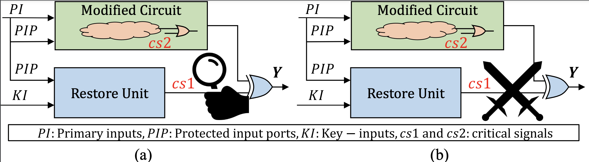

# VALKYRIE: VULNERABILITY ASSESSMENT TOOL AND ATTACK FOR PROVABLY-SECURE LOGIC LOCKING TECHNIQUES
## Contact Info
This repository is the official implementation of the experiments in the following paper:

N. Limaye, S. Patnaik, and O. Sinanoglu, "Valkyrie: Vulnerability Assessment Tool and Attack for Provably-Secure Logic Locking Techniques," in *IEEE Transactions on Information Forensics and Security*, vol. 17, pp. 744-759, 2022, doi: 10.1109/TIFS.2022.3149147.

[IEEE Link](https://ieeexplore.ieee.org/document/9703350)

**Contact**
Nimisha Limaye (nimisha.limaye@nyu.edu) or Satwik Patnaik (sp4012@nyu.edu)
## Citation
If you make use of the code/experiment or Valkyrie algorithm in your work, please cite our paper (Bibtex below).
```
@ARTICLE{9703350,
  author={Limaye, Nimisha and Patnaik, Satwik and Sinanoglu, Ozgur},
  journal={IEEE Transactions on Information Forensics and Security},
  title={Valkyrie: Vulnerability Assessment Tool and Attack for Provably-Secure Logic Locking Techniques},
  year={2022},
  volume={17},
  number={},
  pages={744-759},
  doi={10.1109/TIFS.2022.3149147}}
```
## Overview
Valkyrie is a security diagnostic tool for provably secure logic locking techniques. It can identify structural vulnerabilities in the locked netlist susceptible to a circuit-recovery attack. It uses an original netlist and a locked netlist.



## Requirement
        1. Synopsys Design Compiler (use alias dc_shell-t)
        2. Cadence Conformal LEC (use alias lec)
        3. GNUPG (gpg) for decrypting source files

### The tool requires the following arguments:
        1. Input file (locked verilog)
        2. Input file (original verilog)
        3. Output folder
        4. Library path (.db and .lib)
        5. Library module
        6. Key_variable name
        7. Key-size
        8. Circuit cone size of locking unit/restore unit (include key-inputs and primary inputs)
        9. Name of logic0 and logic1 instance in library module

## Examples:
        ./Valkyrie returns the Usage of the tool

        ./Valkyrie --design TTLock/b14_C/keysize_64/b14_C_TTLock_k_64_1_syn.v --orig_design Verilog/original/b14_C_2inp_gates_syn.v --lib lib/Nangate_Library_slow_ccs.db --lec_lib lib/NangateOpenCellLibrary_slow_ccs.lib --key_var key --keysize 64 --circuit_cone_size 128 --lib_module NangateOpenCellLibrary --logic0 LOGIC0_X1 --logic1 LOGIC1_X1 --technique DFLT --op_folder TTLock_new/ |tee log_b14_C_k_64_TTLock_1

        ./Valkyrie --design AntiSAT/b14_C/keysize_128/b14_C_AntiSAT_k_128_1_syn.v --orig_design Verilog/original/b14_C_2inp_gates_syn.v --lib lib/Nangate_Library_slow_ccs.db --lec_lib lib/NangateOpenCellLibrary_slow_ccs.lib --key_var key --keysize 128 --circuit_cone_size 192 --lib_module NangateOpenCellLibrary --logic0 LOGIC0_X1 --logic1 LOGIC1_X1 --technique SFLT --op_folder AntiSAT_new/ | tee log_b14_C_k_128_AntiSAT_1
        
